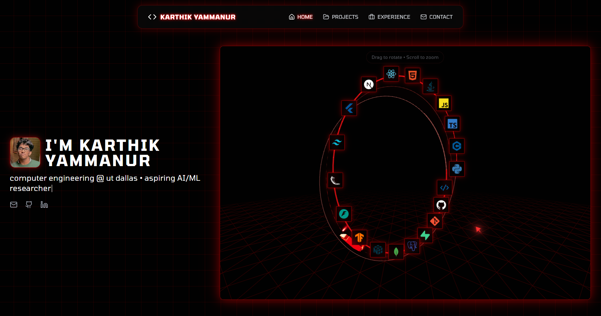

  <h1>Karthik Yammanur</h1>
  
  

   
   

  

    
    &nbsp;&nbsp;
    
    &nbsp;&nbsp;
    
  

   
  
  ### portfolio website
  

 

> **Current Status:** Software Engineering Intern @ **Manada Technologies** > **Focus:** MLOps, RAG Systems, and Agentic Workflows.

I am a Computer Engineering undergraduate specializing in building scalable AI applications. I bridge the gap between **research** (Generative CV, VAEs) and **production engineering** (Next.js, FastAPI, Azure Cloud).

---

### 🏛️ Selected Work & Experience

| Role / Project | Description & Impact | Tech Stack |
| :--- | :--- | :--- |
| **Manada Technologies** *(Software Eng. Intern)* | Architected an anti-hallucination validation system for financial docs using **Azure OpenAI**.  ‣ *Result:* Reduced hallucinations by 50% and enabled 100% data traceability. | `Azure OpenAI` `Python` `MLOps` |
| **AutoPM** *(2nd Place @ HackUTD)* | AI platform automating Product Management workflows using 8+ **LangGraph** agents.  ‣ *Result:* Reduced workflow analysis from weeks to ~60 seconds. | `LangGraph` `Gemini API` `React` |
| **AgentFlow** *(In Development)* | Full-stack deployment platform for AI agents with sandboxed execution (VM2).  ‣ *Features:* Real-time monitoring, GitHub OAuth, serverless API routes. | `Next.js` `TypeScript` `Prisma` |
| **CelestAI** *(ACM Research)* | Built generative CV models (DCGAN, VQGAN) to synthesize rare astronomical data.  ‣ *Result:* Improved rare event detection recall by 15%. | `TensorFlow` `PyTorch` `CV` |

---

### 🛠️ Technical Arsenal

 

 

 

  

