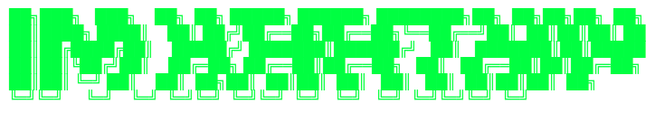

<div align="center">



<a href="https://git.io/typing-svg">
  
</a>

<br/>

<a href="https://karthikyammanur.me/"></a>
&nbsp;
<a href="https://www.linkedin.com/in/karthik-yammanur/"></a>
&nbsp;
<a href="mailto:karthikyam2006@gmail.com"></a>

</div>

<br/>

```console
karthik@utd:~$ whoami
```

```yaml
name: Karthik Yammanur
education: B.S. Computer Engineering @ UT Dallas (Dec 2027)
now: ML Research Intern - multi-view pose estimation for early Parkinson's detection
prev: SWE Intern @ Manada Technologies - production GPT-4o financial document pipeline
wins: [1st @ HackAI 2026, 2nd @ HackUTD 2025]
interests: [agentic systems, MLOps, computer vision, full-stack AI products]
```

## What I'm doing right now

**ML Research - UTD School of Behavioral and Brain Sciences** *(Jan 2026 – Present)*
Supervised multi-view pose estimation on a six-camera rig for early Parkinson's detection. Training and running inference with Lightning Pose on Linux/CUDA, refining keypoint trajectories with Ensemble Kalman Smoothing.

## Featured builds

| Project | What it is | Stack |
| :--- | :--- | :--- |
| **[Pondr](https://github.com/karthikyammanur/pondr-hackai-2026)** <br> 1st Place @ HackAI 2026 · [demo](https://www.youtube.com/watch?v=tXF55DuBK8k) | Adaptive learning platform that models your knowledge as a live concept graph. XGBoost retention model trained on 1,000 synthetic learner profiles - 67% personalization lift (RMSE 0.0524) - across 35+ REST endpoints and 6 integrated AI/ML systems. | `FastAPI` `React` `XGBoost` `Gemini` |
| **[AutoPM](https://github.com/karthikyammanur/auto-pm-hackutd-2025)** <br> 2nd Place @ HackUTD 2025 (1200+ hackers) · [demo](https://www.youtube.com/watch?v=sNpusFMyFoI) | Multi-agent PM copilot: 8 LangGraph agents handling market research, RICE prioritization, OKR alignment, wireframes, and live Gmail + Jira integration - idea to ticket, end to end. | `LangGraph` `Next.js` `TypeScript` `Zod` |
| **[Matcha](https://github.com/karthikyammanur/matcha_hacks_for_hackers_2026)** <br> Hacks for Hackers 2026 · [demo](https://www.youtube.com/watch?v=bx2dYwqAUJI) | Hackathon teammate matching from a single Devpost link. Hybrid algorithmic + LLM matching cuts AI processing ~95% without losing match quality. | `React` `Flask` `Gemini` `MongoDB` |
| **[saimeghna.com](https://saimeghna.com)** <br> Live client production site | Full rebuild for a Kuchipudi dance academy - cinematic dark UI, Cloudinary media pipeline, Resend contact automation, and a Gemini 2.5 chatbot. | `Next.js 15` `Tailwind 4` `MongoDB Atlas` |
| **[Portfolio](https://karthikyammanur.me/)** <br> Live · [karthikyammanur.me](https://karthikyammanur.me/) | TRON-themed personal site with a 3D Möbius strip, hex-grid cursor trail, and animated transitions - built for fun and over-engineered on purpose. | `React 19` `TypeScript` `Three.js` `Framer Motion` |

<div align="center">
  <a href="https://github.com/karthikyammanur?tab=repositories"></a>
</div>

## Stack

<div align="center">
  
  <br/>
  
  <br/>
  
</div>

## Activity

<div align="center">
  
  
</div>

<br/>

<picture>
  <source media="(prefers-color-scheme: dark)" srcset="https://raw.githubusercontent.com/karthikyammanur/karthikyammanur/output/github-snake-dark.svg" />
  <source media="(prefers-color-scheme: light)" srcset="https://raw.githubusercontent.com/karthikyammanur/karthikyammanur/output/github-snake.svg" />
  
</picture>
